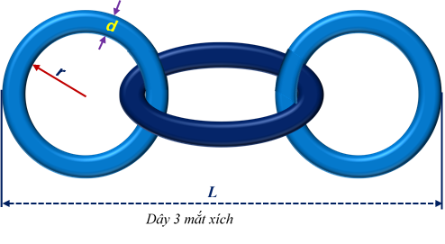

			<h3><a name="_Toc446261323">DÂY XÍCH</a></h3>

Người ta dùng dây thép tròn độ dày (đường kính thiết diện ngang) <strong><em>d</em></strong> làm <strong><em>n</em></strong> vòng tròn bán kính vòng tròn trong là <strong><em>r</em></strong>, móc nối với nhau thành một dây xích, mỗi vòng tròn là một mắt xích. Hình 1 nêu trường hợp dây có 3 mắt xích. Nếu dây xích có nhiều hơn một mắt xích thì tồn tại hai vòng tròn, mỗi vòng chỉ nối với đúng một vòng tròn khác, đó là các mắt xích đầu và cuối.&nbsp; Cầm 2 mắt xích đầu và cuối, kéo căng ra, ta có dây xích độ dài <strong><em>L</em></strong>.

Cho <strong><em>d</em></strong>, <strong><em>r</em></strong> và <strong><em>n</em></strong>. Hãy tính độ dài <strong><em>L</em></strong> của dây xích.

<strong><em>Dữ liệu:</em></strong> Vào từ thiết bị nhập chuẩn 3 số nguyên <strong><em>d</em></strong>, <strong><em>r</em></strong> và <strong><em>n</em></strong> (1≤<strong><em>d</em></strong>&lt;<strong><em>r</em></strong>≤100, 1≤ <strong><em>n</em></strong> ≤109).

<strong><em>Kết quả:</em></strong> Đưa ra thiết bị xuất chuẩn một số nguyên – độ dài <strong><em>L</em></strong> tìm được.

<strong><em>Ví dụ:</em></strong>

<table align="left" border="1" cellspacing="1">
	<tbody>
		<tr>
			<td style="background-color:#ffffcc; border-color:black; width:85.5pt">
			
<tt>INPUT</tt>

			</td>
			<td style="width:40.5pt">
			
&nbsp;

			</td>
			<td style="background-color:#ffffcc; border-color:black; width:90.0pt">
			
<tt>OUTPUT</tt>

			</td>
		</tr>
		<tr>
			<td style="background-color:#ffffcc; border-color:black; height:11.95pt; width:85.5pt">
			
<tt><strong>2 10 3</strong></tt>

			</td>
			<td style="height:11.95pt; vertical-align:bottom; width:40.5pt">
			
&nbsp;

			</td>
			<td style="background-color:#ffffcc; height:11.95pt; width:90.0pt">
			
<tt><strong>64</strong></tt>

			</td>
		</tr>
	</tbody>
</table>

&nbsp;

&nbsp;

		
